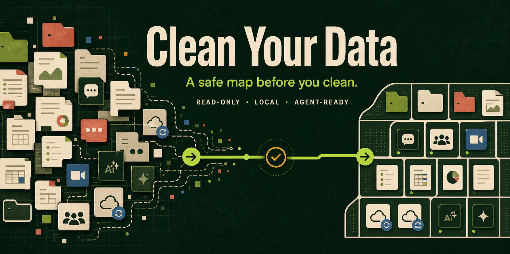

# Clean Your Data

[](https://github.com/MicroMilo/clean-your-data/actions/workflows/test.yml)
[](LICENSE)

<p align="center">
  
</p>

**Your files are everywhere. Get a safe map before you touch anything.**

**Clean Your Data** turns local file sprawl into a privacy-preserving, decision-ready audit. It finds where data accumulates across Desktop, Downloads, AI workspaces, Git repositories, chat and collaboration apps, cloud-sync folders, and rebuildable project artifacts.

It is read-only by default. It does not read private content, upload data, or delete files.

## Give It To Your Agent

You can send this repository URL to Codex or another local agent:

<https://github.com/MicroMilo/clean-your-data>

Use a message like this:

> Read and use the Clean Your Data skill from this repository. Analyze my local home directory with a read-only, metadata-only audit. Start with the quick audit, keep paths anonymized, do not read chat, browser, mail, document, source, or credential contents, and do not move or delete anything. Give me a decision-ready report: what is accumulating, what owns it, what is durable versus rebuildable, the risks, and the safest next actions.

The agent can clone the repository, read `audit-local-files/SKILL.md`, and run the bundled scanner locally. The GitHub page itself never receives access to the user's computer.

## Why Use This Instead Of Asking Codex Directly?

Codex can perform a one-off analysis. This repository packages the part that should be consistent every time:

| Direct prompt | Clean Your Data |
| --- | --- |
| You decide what to inspect | A curated inventory covers common workspaces, app state, cloud sync, AI tools, Git, and artifacts |
| The safety boundary depends on your wording | Read-only, metadata-only, redacted defaults are part of the workflow |
| Results vary from prompt to prompt | A stable taxonomy separates assets, workspaces, app-managed data, caches, and unknowns |
| You get a list of large folders | You get an explanation, risk level, owner-aware action, and approval gate |
| It is easy to repeat inconsistently | Save JSON snapshots and compare what grew over time |

The skill is not a replacement for Codex. It is a reusable local-audit protocol that gives Codex reliable coverage, privacy boundaries, and a repeatable output contract.

## The Workflow

```text
discover -> classify -> explain -> assess risk -> plan action -> compare over time
```

The useful question is not only “what is large?” It is:

> What is this data, who owns it, can it be rebuilt, and what can I safely do next?

## Quick Start

From the repository root:

```bash
python3 audit-local-files/scripts/audit_local_files.py --format markdown
```

Open a more readable, self-contained report in a browser or print it to PDF:

```bash
python3 audit-local-files/scripts/audit_local_files.py \
  --format html \
  --output local-file-audit.html
```

The HTML is generated locally, has no external assets, and starts with the decision state, evidence blockers, and the largest areas before showing the detailed tables. Use JSON for Agent handoff and snapshot comparison.

Write a local report:

```bash
python3 audit-local-files/scripts/audit_local_files.py \
  --format markdown \
  --output local-file-audit.md
```

Run a deeper audit before reorganizing a machine:

```bash
python3 audit-local-files/scripts/audit_local_files.py \
  --mode full \
  --children \
  --artifacts \
  --git-status \
  --format markdown \
  --output local-file-audit-full.md
```

The scanner never changes the scanned files. Cleanup or migration is a separate, approval-gated decision.

## Compare Audits Over Time

JSON output is a local snapshot. Save two snapshots and compare them:

```bash
mkdir -p snapshots

python3 audit-local-files/scripts/audit_local_files.py \
  --mode full --children --artifacts --git-status \
  --format json --output snapshots/before.json

# Use the machine normally, then run the same command again as after.json.

python3 audit-local-files/scripts/compare_reports.py \
  snapshots/before.json snapshots/after.json
```

The comparison highlights disk usage, target areas, Codex workspace counts, Git dirty changes, and rebuildable artifacts that changed. Keep snapshots local unless you review their paths first.

## Evidence, Not Guesswork

The JSON report now carries a small decision contract:

- `measurement_status` distinguishes measured, timeout, error, missing, and unknown;
- `coverage` records which target families were actually measured;
- `findings` links each recommendation to evidence, owner, risk, confidence, and rollback/rebuild guidance;
- `action_gate` keeps the result in `review_only` when evidence is incomplete or dirty Git work must be preserved.

Validate a saved snapshot before handing it to another Agent:

```bash
python3 audit-local-files/scripts/validate_report.py snapshots/before.json
```

HTML is intended for local review. It follows the report's redaction settings, but you should still review project and folder names before sharing it.

Artifact rows are candidate subsets. They may already be included in a parent workspace total, so the report does not present them as additive reclaimable space.

## How We Iterate The Skill

The project uses a maintainer-only evaluation loop: run a real local audit, aggregate and redact the evidence, ask independent roles to review it, synthesize the smallest change, then run contract and fixture tests before publishing. Raw local reports never enter the repository. See [the evaluation loop](audit-local-files/references/agentic-evaluation.md).

## What A Useful Result Looks Like

The report is designed to turn raw measurements into a next step:

```text
Main pattern: data is concentrated in AI workspaces, app-managed storage,
and project build artifacts.

Interpretation:
- AI workspace: inspect and promote durable outputs before archiving.
- App-managed storage: use the owning app's storage controls; do not delete
  its container directly.
- Build artifact: potentially rebuildable, but check the project and disk
  cost before removal.
- Dirty Git repository: preserve or commit/stash changes before moving it.

Next action: review exact paths, then approve one reversible category at a time.
```

See the [anonymized sample report](examples/sample-report.md) and the [agent handoff prompt](examples/agent-handoff.md).

## Privacy And Safety

The scanner collects local metadata only:

- path existence and home-relative paths;
- allocated directory size;
- modification time;
- optional Git repository and dirty-entry counts.

It does not read chat messages, browser history, email bodies, document text, source code, credentials, or keychains. It does not make network requests and does not upload reports.

Reports redact the home directory to `~` by default. Git origin URLs are omitted by default. Review project and folder names before sharing any report publicly. Do not publish reports generated with `--no-redact` or `--include-git-origins`.

The scanner does not perform cleanup. App-managed data should be handled by the owning app; rebuildable artifacts should be removed only after their exact paths, rebuild cost, and rollback options are understood.

## Install As A Codex Skill

An agent can install the `audit-local-files/` directory as a Codex skill. For a manual local install:

```bash
git clone https://github.com/MicroMilo/clean-your-data.git
mkdir -p ~/.codex/skills
cp -R clean-your-data/audit-local-files ~/.codex/skills/audit-local-files
```

Then ask Codex:

```text
Use $audit-local-files to audit my local file organization. Start read-only and anonymized. Do not delete anything.
```

## Dependencies

- Python 3.9+
- `du` on macOS/Linux for fast allocated-size measurement
- `git` only for Git discovery or status checks

No third-party Python packages are required.

## 中文说明

**先看清，再动手。**

**Clean Your Data** 把电脑里的文件沉积转换成一份隐私友好、可以做决定的本地审计报告。它会检查 Desktop、Downloads、AI 工作区、Git 仓库、微信/飞书等协作 App、本地云盘，以及 `node_modules`、`.venv`、`build` 等可重建产物。

默认只读、只读取元数据，不读取私密正文，不上传数据，也不会删除文件。

### 交给你的 Agent

把这个 GitHub 地址发给 Codex 或其他本地 Agent：

<https://github.com/MicroMilo/clean-your-data>

可以直接附上：

> 请读取并使用这个仓库里的 Clean Your Data skill。对我的本地 home 目录做一次只读、只读取元数据的审计。先运行快速模式，路径保持匿名化，不读取聊天、浏览器、邮件、文档、源码或凭据内容，也不要移动或删除任何文件。请输出一份可以做决定的报告：哪些数据正在沉积、由谁管理、哪些是长期资产或可重建产物、风险是什么，以及最安全的下一步。

Agent 可以下载仓库、读取 `audit-local-files/SKILL.md`，然后在用户电脑本地运行扫描器。GitHub 页面本身不会获得用户电脑的访问权限。

### 为什么不直接问 Codex

Codex 可以完成一次分析，但这个仓库把每次都应该保持一致的部分固定下来：覆盖范围、隐私边界、分类标准、风险判断、行动审批和历史比较。它不是替代 Codex，而是让 Codex 以一套可重复、可审计的本地数据体检流程工作。

### 工作流

```text
发现 -> 分类 -> 解释 -> 判断风险 -> 生成行动计划 -> 定期比较
```

真正要回答的不是“哪里最大”，而是：

> 这些数据是什么、由谁管理、能否重建、我接下来怎样处理才不会误删？

### 快速运行

```bash
python3 audit-local-files/scripts/audit_local_files.py --format markdown
```

更适合人直接阅读的离线 HTML 报告：

```bash
python3 audit-local-files/scripts/audit_local_files.py \
  --format html --output local-file-audit.html
```

HTML 会先展示决策状态、证据阻塞项和最大目录，再展开 Git、Codex 工作区、App 数据和可重建产物。它是本地生成的单文件，不依赖网络；JSON 仍用于 Agent 交接和历史比较。

深度模式：

```bash
python3 audit-local-files/scripts/audit_local_files.py \
  --mode full --children --artifacts --git-status \
  --format markdown --output local-file-audit-full.md
```

保存 JSON 快照后，可以用 `audit-local-files/scripts/compare_reports.py` 比较两次审计，观察哪些区域在增长。

交给其他 Agent 之前，可以先运行 `python3 audit-local-files/scripts/validate_report.py snapshots/before.json` 校验报告契约。

JSON 报告还会区分 `measured`、`timeout`、`error`、`missing` 和 `unknown`，记录 coverage、证据关联的 findings，以及是否因为证据不足或 Git dirty 状态而只能停留在 `review_only`。artifact 可能已经包含在父工作区大小中，不会被当成可回收空间重复相加。

### 隐私与安全

扫描器只读取路径、占用大小、修改时间和可选的 Git 状态计数；不会读取聊天、浏览器历史、邮件正文、文档正文、源码、凭据或 keychain。默认把 home 目录显示为 `~`，默认不输出 Git origin URL。任何公开分享前，都应检查项目名和文件夹名。

项目维护时会使用真实本机审计的聚合匿名证据包，让不同 Agent 角色独立评审，再通过确定性 fixture 和 schema 测试后发布；原始本机报告不会进入仓库。

### 依赖

Python 3.9+；macOS/Linux 上的 `du`；只有在进行 Git 检查时才需要 `git`。不需要第三方 Python 包。

## License

MIT. See [LICENSE](LICENSE).
